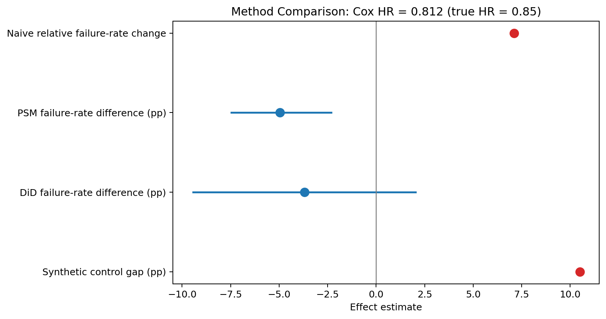

# Causal Field Analytics

> **Estimating the impact of engineering design changes on field-failure rates from observational data — with survival analysis for reliability-engineering stakeholders.**

[](https://www.python.org/)
[](https://www.pywhy.org/dowhy/)
[](https://lifelines.readthedocs.io/)
[](https://quarto.org/)

Engineering organizations constantly make design changes — a supplier swap, a firmware update, a refrigerant-driven redesign — and then ask *"did this actually improve field reliability?"* The naive answer (compare failure rates before vs. after) is wrong. This project shows why, and builds the right toolkit.

**Live report:** [aalias01.github.io/causal-field-analytics](https://aalias01.github.io/causal-field-analytics/report/causal_field_analytics.html)  
**GitHub:** [aalias01/causal-field-analytics](https://github.com/aalias01/causal-field-analytics)



---

## The Central Argument

```
Naive before/after comparison: "The design change made failure rates WORSE (+7.11%)"
↓
What the naive view is missing:
  • Seasonality: HVAC fails more in July regardless of design
  • Selection bias: newer units got the redesign AND have lower baseline failure rates
  • Regional confounding: Southeast rollout first — climate differs
  • Reporting lag: recently-installed units haven't had enough time to fail yet
↓
Causal methods that control for these confounders: "The change REDUCED failure probability by 4.97 percentage points (95% CI: [-7.52, -2.27])"
↓
Survival analysis framing for reliability teams: "Cox-adjusted B10 life increased from 6 to 8 months (Cox HR = 0.812)"
```

*This is what 7 years of observational field-failure judgment at Daikin and Rheem looks like applied to statistics.*

---

## Methods Compared

| Method | Identifying Assumption | What It Answers |
|--------|----------------------|-----------------|
| Naive before/after *(straw man)* | None — intentionally wrong | Baseline for how bad naive analysis is |
| Propensity Score Matching | No unmeasured confounders | Average Treatment Effect on the Treated (ATT) |
| Difference-in-Differences | Parallel pre-treatment trends | Causal effect of timed rollout |
| Synthetic Control | Pre-treatment trajectory fit | Counterfactual for single-region rollout |
| **Cox Proportional Hazards** | Proportional hazards (testable) | **Hazard ratio + B10-life for reliability teams** |

*The value is showing estimates converge — or honestly reporting where they don't, and why.*

---

## Key Results

| Method | Effect Estimate | 95% CI | Notes |
|--------|----------------|--------|-------|
| Naive comparison | +7.11% relative failure increase | — | Confounded — incorrect direction |
| Propensity Score Matching | -4.97 pp | [-7.52, -2.27] pp | Main causal failure-rate estimate |
| Difference-in-Differences | -3.70 pp | [-9.48, 2.08] pp | Directionally consistent, underpowered |
| Synthetic Control | +10.50 pp gap | — | Rejected: poor pre-treatment fit |
| Cox PH (hazard ratio) | 0.812 | [0.718, 0.918] | Main reliability estimate |
| **Cox-adjusted B10-life: old design** | 6 months | — | 10% cumulative failure under reference covariates |
| **Cox-adjusted B10-life: new design** | 8 months | — | +2 month warranty-window improvement |

---

## Dataset

**Synthetic field panel with known ground truth** — generated by `src/data_generator.py`.

~5,000 equipment units, 24-month observation window.

| Feature | Description |
|---------|-------------|
| `unit_id` | Unique equipment identifier |
| `install_date` | Enrollment date (survival start) |
| `region` | 4 geographic regions (confounds treatment assignment) |
| `install_crew` | 3 crew types (confounds failure rate) |
| `design_variant` | Treatment (B = new design) vs. control (A = old) |
| `failure_event` | 1 = failure observed, 0 = right-censored |
| `time_to_event` | Months from install to failure or end-of-window |
| **True causal effect** | Variant B reduces failure hazard by **15%** (the ground truth to recover) |

The synthetic rollout is intentionally non-random: variant B enters the Southeast first, and the Southeast has higher baseline hazard. That makes the naive result point in the wrong direction, which is the stakeholder problem this project is built to solve.

**Why synthetic-with-known-truth is the right choice here:**
> *"A real dataset never tells you what the truth was. A synthetic panel with known ground truth lets me run each method and show exactly how close it gets — and where each one breaks under confounding. That's a methodology showcase a real dataset can't give you."*

---

## Tech Stack

| Layer | Tool |
|-------|------|
| Causal framework | DoWhy — identification → estimation → refutation |
| Propensity matching | causalinference |
| DiD | statsmodels OLS with fixed effects |
| Synthetic control | pysyncon |
| Survival analysis | lifelines (KM, Cox PH, Weibull AFT) |
| Modern causal estimators | EconML (DML, DR-Learner) |
| Report | Quarto → static HTML → GitHub Pages |

---

## Setup

```bash
git clone https://github.com/aalias01/causal-field-analytics
cd causal-field-analytics

conda env create -f environment.yml
conda activate causal-field
python -m ipykernel install --user --name causal-field --display-name "causal-field"

# Generate the synthetic panel (runs in seconds — no downloads)
python src/data_generator.py

# Reproduce portfolio metrics and figures
python scripts/portfolio_analysis.py

# Render the report
quarto render report/causal_field_analytics.qmd
```

If `python` is not on your shell path, use:

```bash
conda run -n causal-field python scripts/portfolio_analysis.py
quarto render report/causal_field_analytics.qmd
```

---

## Interview Context

1. **The naive problem:** *"At Daikin, I saw teams declare victory on a design change that was really just a seasonal dip. And I've seen good changes get blamed for problems they didn't cause. This is the toolkit I wish we'd had — and what I'd build first on day one with a reliability team."*

2. **Why four causal methods?** *"Each has a different identifying assumption. The right answer is to show estimates converge — or honestly report where they don't and why. Stakeholders trust that honesty more than a single flashy number."*

3. **Cross-lane:** *"Propensity matching on customer features, DiD on region rollouts, CUPED for variance reduction — that's the Costco/Amazon experimentation stack. Cox PH with B10-life output — that's the Boeing/GE Vernova reliability stack. Same methodology, two dialects."*

4. **Survival analysis bridge:** *"Reliability engineering's vocabulary — MTBF, hazard rate, B10 life — is just biostatistics survival analysis. A field-failure panel is literally a survival dataset: install date = enrollment, failure = event, units that haven't failed = right-censored. I can talk to a reliability engineer or a biostatistician with the same toolkit. That cross is rare at the entry-DS level."*

5. **The ground-truth move:** *"True causal effect: variant B reduces hazard by 15%. I run each method and show how close it gets. That's a teaching-through-demonstration move a real dataset can't give you."*

---

*Built by [Alvin Alias](https://github.com/aalias01) — MS Data Science, University of Washington · 7 years Daikin/Rheem field-failure analytics · DATA 557 Applied Statistics & Experimental Design*
