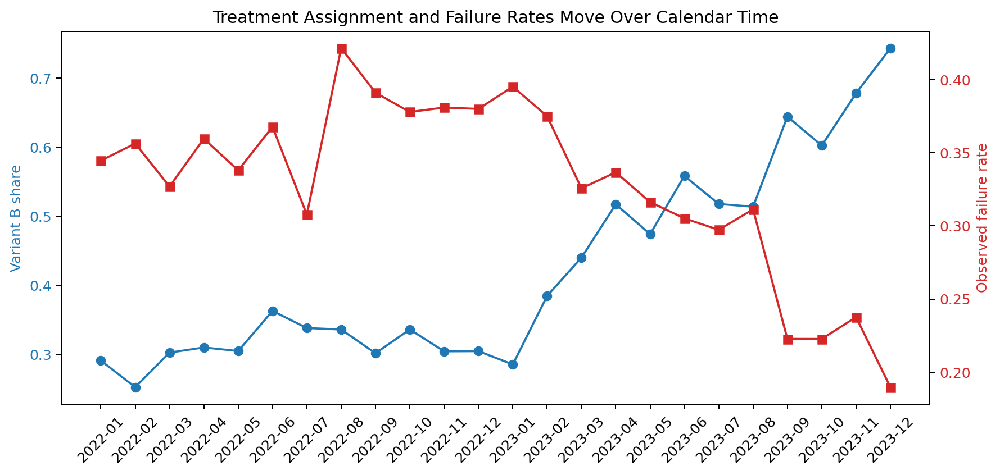
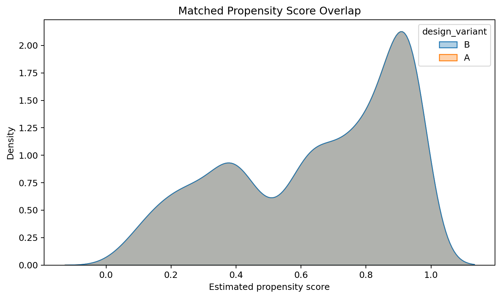
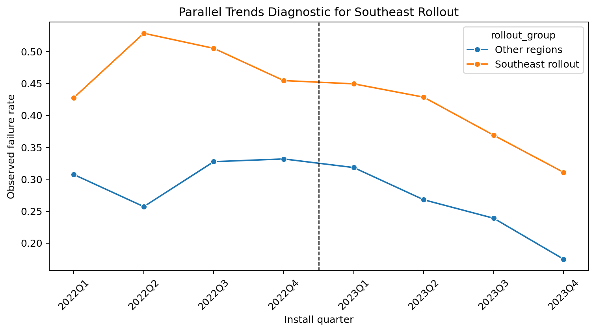
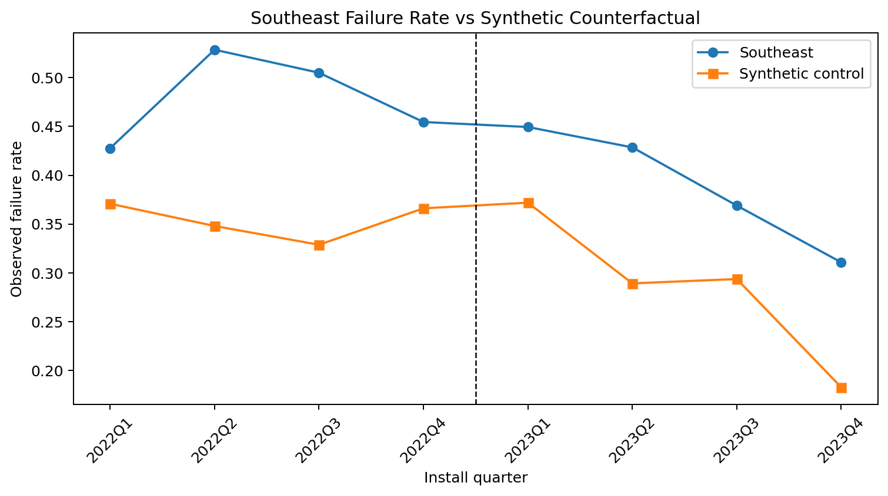
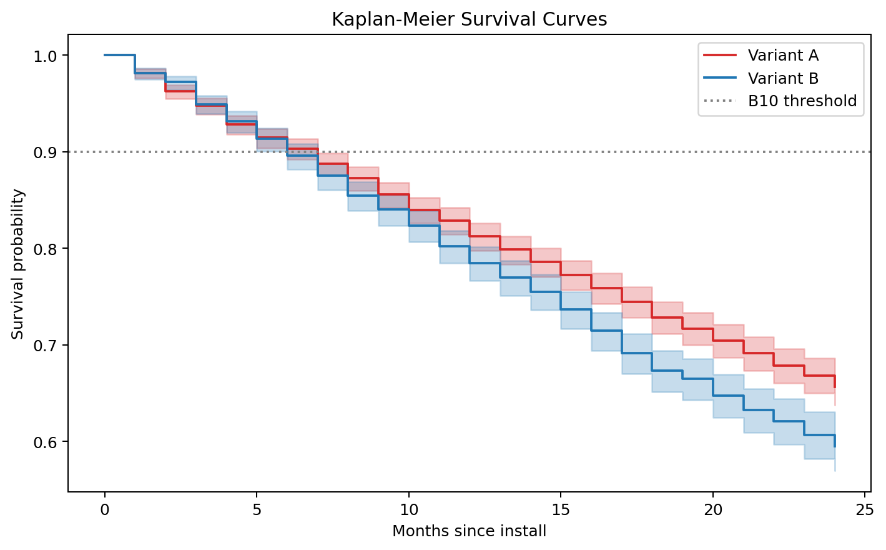

## Executive Summary

Engineering organizations constantly make design changes -- a supplier swap, a firmware update, a refrigerant-driven redesign -- and then ask: *did this actually improve field reliability?*

The naive answer says **no**. In this simulated field panel, a simple observed failure-rate comparison says variant B increased failures by **2.27 percentage points** (**+7.11% relative**). That is the wrong conclusion: variant B has a known ground-truth hazard ratio of **0.85**, meaning a **15% lower failure hazard**.

After controlling for rollout bias, region, install crew, install month, and operating hours:

- Propensity score matching estimates a **-4.97 percentage-point** failure-rate reduction (95% CI: **[-7.52, -2.27]**).
- Cox proportional hazards estimates **HR = 0.812** (95% CI: **[0.718, 0.918]**, p = **0.0009**).
- Cox-adjusted B10 life improves from **6.0 months** under the old design to **8.0 months** under the new design.

The honest diagnostic story matters too: DiD points in the protective direction but is imprecise, while synthetic control has poor pre-treatment fit and should not be trusted for the headline estimate. That is exactly the point of the project: causal methods are not interchangeable buttons; they are assumptions that must be checked.

::: {.callout-note}
**On the data:** This analysis uses a synthetic field panel with known ground truth. That is intentional. A real observational dataset almost never reveals the true treatment effect, while a known-truth simulation lets each method be evaluated directly.
:::

## Dataset

The panel contains **5,000 equipment units** observed for up to 24 months:

- Variant A control units: **2,887**
- Variant B treated units: **2,113**
- Ground truth: variant B reduces failure hazard by **15%** (**HR = 0.85**)
- Confounders: region, install crew, install month, operating hours, seasonality, right-censoring, and non-random rollout

The data-generating process intentionally makes variant B more likely in the Southeast, the hottest and highest-hazard region. This creates the portfolio hook: the new design is genuinely better, but its rollout pattern makes the naive comparison look worse.



## Why Naive Analysis Lies

The observed failure rates are:

| Design | Observed Failure Rate |
|---|---:|
| Variant A | 31.90% |
| Variant B | 34.17% |

Naively, variant B appears to increase failures by **2.27 percentage points**. That estimate mixes the design effect with three sources of bias:

- **Regional confounding:** variant B enters the Southeast first, and Southeast equipment has higher baseline hazard.
- **Calendar-time confounding:** newer installs are more likely to receive variant B, while seasonality shifts failure risk over the observation window.
- **Right-censoring:** units installed later have less time at risk.

## Causal DAG

```text
install_date  -> design_variant -> failure_event
     |                                ^
     +--------------------------------+

region        -> design_variant       |
     +--------------------------------+

install_crew  ----------------------> failure_event
operating_hours --------------------> failure_event
seasonality   ----------------------> failure_event
```

`install_date`, `region`, `install_crew`, and usage intensity must be controlled before the design effect is interpreted.

## Propensity Score Matching

**Identifying assumption:** no unmeasured confounders after controlling for observed rollout drivers.

The propensity model predicts treatment assignment from region, install crew, install month, and operating hours, then matches each treated unit to the nearest control unit in propensity-score space.



| Metric | Value |
|---|---:|
| Matched treated-control pairs | 2,113 |
| Failure-rate effect | -4.97 pp |
| 95% bootstrap CI | [-7.52, -2.27] pp |

The matched estimate says variant B reduces observed failure probability once treatment assignment bias is controlled.

## Difference-in-Differences

**Identifying assumption:** the Southeast rollout group and other regions would have followed parallel failure-rate trends without treatment.



The estimated rollout effect is **-3.70 percentage points** (95% CI: **[-9.48, 2.08]**, p = **0.2101**).

This points in the same protective direction as PSM and Cox PH, but the confidence interval crosses zero. For a portfolio project, that is a feature rather than a bug: the report shows the diagnostic and does not overclaim.

## Synthetic Control

**Identifying assumption:** a weighted combination of control regions can reproduce the Southeast's pre-treatment trend.



The optimizer puts all weight on the Southwest, with a pre-treatment RMSPE of **13.66 percentage points**. That is poor pre-treatment fit, so this method is not used for the headline conclusion.

Synthetic control is still valuable here because it teaches the right behavior: when the counterfactual is weak, do not dress it up as evidence.

## Survival Analysis

Field-failure data is naturally survival data:

- install date = enrollment
- failure event = event
- units still running = right-censored observations



The unadjusted Kaplan-Meier curves are visibly confounded by the Southeast-heavy rollout. The adjusted Cox model is the right reliability headline.

| Survival Metric | Value |
|---|---:|
| Cox hazard ratio for variant B | 0.812 |
| 95% CI | [0.718, 0.918] |
| p-value | 0.0009 |
| True hazard ratio | 0.850 |
| Treatment PH diagnostic p-value | 0.1961 |
| Cox-adjusted B10, Variant A | 6.0 months |
| Cox-adjusted B10, Variant B | 8.0 months |
| B10 improvement | +2.0 months |

Interpretation: after controlling for region, install crew, install month, and operating hours, variant B reduces instantaneous failure risk by about **18.8%**. The estimate is close to the known true effect of **15%**, and the proportional-hazards diagnostic does not flag the treatment term.

## Method Comparison


| Method | Estimate | 95% CI | Portfolio Interpretation |
|---|---:|---:|---|
| Naive comparison | +7.11% relative failure increase | -- | Wrong direction due to confounding |
| Propensity score matching | -4.97 pp | [-7.52, -2.27] pp | Main causal failure-rate estimate |
| Difference-in-differences | -3.70 pp | [-9.48, 2.08] pp | Directionally consistent, underpowered |
| Synthetic control | +10.50 pp gap | -- | Rejected due to poor pre-fit |
| Cox PH | HR = 0.812 | [0.718, 0.918] | Main reliability estimate |
| Ground truth | HR = 0.850 | -- | Known simulation target |

## Limitations

1. **Synthetic data:** the results demonstrate methodology, not a real product claim.
2. **Unobserved confounding:** PSM and Cox adjust only for measured features.
3. **Synthetic-control fit:** this design does not produce a credible synthetic counterfactual; the diagnostic is intentionally reported.
4. **Time horizon:** B10 is estimated inside a 24-month observation window and should not be extrapolated without stronger parametric validation.

## Conclusion

The naive field-failure comparison gives the wrong business answer: it says the design change made failures worse. After causal adjustment, variant B shows a clear protective effect. The Cox model estimates **HR = 0.812**, close to the true **0.85**, and the adjusted B10 life improves by **2 months**.

For reliability and warranty teams, this is the actionable translation: do not compare raw failure rates after a non-random rollout. Model assignment, censoring, and field conditions first, then turn the causal estimate into reliability language the business can use.

---

*Analysis by Alvin Alias -- MS Data Science, University of Washington; industrial field-failure analytics background across HVAC, manufacturing, and reliability workflows.*
